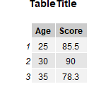

```{r, include = FALSE}
knitr::opts_chunk$set(
  collapse = TRUE,
  comment = "#>",
  eval = FALSE
)
```
The dataletes package provides a set of functions designed for downloading, organizing, and visualizing data.

Consider a situation where a user wants to create an image of a scatterplot of their data to present in a Powerpoint.

The user would likely first need to download their data from the internet. For the rolling_stone dataset, they would utilize the download_data function as such:

```{r download}
raw <- download_rolling_stone_data(
   "https://raw.githubusercontent.com/rfordatascience/tidytuesday/main/data/2024/2024-05-07/rolling_stone.csv",
   "data/rolling_stone.csv")
```
This will download the data from the URL (the first parameter) as a csv into the data directory relative to the working directory of the user specified by the filepath (the second parameter).

Next, the user would clean the data by removing irrelevant columns. For the rolling_stone dataset, we have created a function clean_rolling_stone_data to remove columns such as the spotify_url when taking the data as a dataframe input:
```{r dropcol}
cleaned <- clean_rolling_stone_data(
   raw
)
```
This cleaned data could be saved for later with the save_cleaned_data function as such:
```{r saveclean}
save_cleaned_data(cleaned, "data/processed/cleaned_data.csv")
```
where the first argument is a dataframe input into the function and the second argument is the file path where the data will be saved as a csv.

Once the user has the data cleaned and processed, they will likely want to visualize it to spot trends. A common graph for this purpose is the scatterplot. 
The user can use the generate_scatterplots function to create a series of scatterplots as a list of ggplot2 plots. The first parameter is a list of characters representing the names of the columns to be plotted against the target variable or the dependent variables. These variables will each be on the y axis of their respective scatterplot, with 1 scatterplot for each variable. The second parameter is a dataframe containing the dependent variables and the target variable. The third parameter is the target variable which will be on the x-axis of all of the scatter plots. The fourth parameter is the number that the figure count starts at. Each figure will be numbered starting from the figure number.
If the user wanted to plot differential vs weeks_on_billboard and release_year vs weeks_on_billboard, they would call the function as follows:
```{r plots}
plots <- generate_scatterplots(list("differential","release_year"),train_data,"weeks_on_billboard",1)
```
The user can then use the ggsave function from the ggplot2 library to save the scatterplots as such:
```{r save}
ggsave("results/plot1.png", plots[[1]])
ggsave("results/plot2.png", plots[[2]])
```
The final images are: 

{width=50%}

for the first scatterplot and

{width=50%}

for the second scatterplot. If the user wants to save table data as a PNG, they can do that directly with our 
create_table function as such:
```{r table}

create_table(
   data.frame(
   Age = c(25, 30, 35),
   Score = c(85.5, 90.0, 78.3)
   ),
   "TableTitle",
   "path/to/destination",
   "ImageName",
   list(150,150)
)

```
Which creates this output:

{width=40%}
